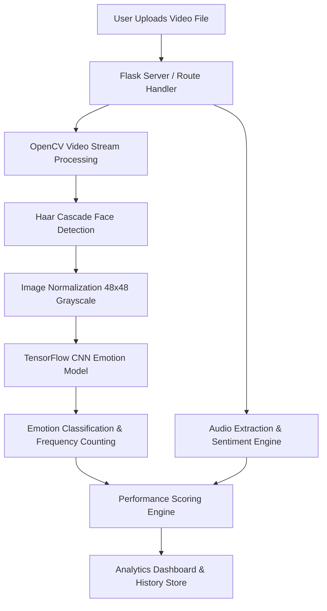

# 🎥 Smart Anchor Analyzer

[](https://www.python.org/)
[](https://flask.palletsprojects.com/)
[](https://www.tensorflow.org/)
[](https://opencv.org/)
[](https://smart-anchor-analyzer.onrender.com/)
[](LICENSE)

An intelligent, AI-driven facial emotion and communication analysis system built with **Flask**, **OpenCV**, **TensorFlow/Keras**, and **Natural Language Processing**. **Smart Anchor Analyzer** evaluates news anchors, public speakers, presenters, and interviewees by processing video recordings to measure facial expressions, stress metrics, speech sentiment, and overall presentation confidence.

---

## 🚀 Live Demo & Links

- **🌐 Live Application:** [https://smart-anchor-analyzer.onrender.com/](https://smart-anchor-analyzer.onrender.com/)
- **📦 GitHub Repository:** [https://github.com/PravalikaMoraboyina123/Smart-Anchor-Analyzer](https://github.com/PravalikaMoraboyina123/Smart-Anchor-Analyzer)

---

## 📌 Table of Contents

- [Overview](#-overview)
- [Key Features](#-key-features)
- [System Architecture](#-system-architecture)
- [Emotion Categories & Analytics Logic](#-emotion-categories--analytics-logic)
- [Technology Stack](#-technology-stack)
- [Project Directory Structure](#-project-directory-structure)
- [Installation & Setup](#-installation--setup)
- [Usage Guide](#-usage-guide)
- [Deployment Configuration](#-deployment-configuration)
- [Performance & Optimization](#-performance--optimization)
- [Future Roadmap](#-future-roadmap)
- [Author & Contact](#-author--contact)
- [License](#-license)

---

## 🔍 Overview

Delivering a strong presentation or news broadcast requires high emotional stability, confidence, and positive delivery. **Smart Anchor Analyzer** automates the assessment of speaker performance using Computer Vision and Deep Learning.

By ingesting video files, the system extracts facial frames at calculated intervals, detects expressions via a custom Convolutional Neural Network (CNN), inspects speech elements, and yields actionable insights—including a consolidated **Performance Score**.

---

## ✨ Key Features

- 🎭 **Facial Emotion Recognition:** Real-time and frame-by-frame emotion detection across 7 expression classes using a trained Deep Learning (Keras/TensorFlow) model.
- 📐 **Automated Face Detection:** Utilizes OpenCV's Haar Cascade classifier to locate, isolate, and crop facial regions for analysis.
- 📊 **Multimodal Performance Scoring:** Combines facial confidence, stress deductions, and speech sentiment to compute an overall speaker performance metric.
- 📈 **Interactive Analytics Dashboard:** Visual summaries showing facial expression distribution, confidence index, and stress indicators.
- 📜 **Historical Tracking:** Keeps track of processed video uploads and performance ratings within the active session history.
- ⚡ **Optimized Cloud Deployment:** Lightweight frame-sampling pipeline tailored for seamless hosting on platforms like Render.
- 💻 **Cross-Platform Script Support:** Includes standalone CLI tool scripts for detailed audio transcription (Whisper AI) and interactive video stream processing.

---

## 🔄 System Architecture



### Analytical Pipeline:
1. **Video Ingestion:** Accepts uploaded MP4/AVI/MOV video files securely through Flask.
2. **Frame Sampling:** Reads frames at regular intervals (1 frame/sec) using OpenCV to maximize speed and minimize compute overhead.
3. **Face Extraction & Rescaling:** Identifies face regions, resizes them to `48x48` grayscale matrices, and normalizes pixel values to `[0, 1]`.
4. **Deep Learning Inference:** Passes facial features through `emotion_model.h5` to classify expressions.
5. **Speech & Sentiment Evaluation:** Inspects audio properties and extracts text sentiment via MoviePy & TextBlob.
6. **Metric Aggregation:** Calculates confidence, stress, and final scores for rendering in the UI.

---

## 📊 Emotion Categories & Analytics Logic

### Supported Emotion Classes
The classification model identifies **7 facial expression states**:
- 😊 **Happy**
- 😐 **Neutral**
- 😮 **Surprise**
- 😔 **Sad**
- 😡 **Angry**
- 😨 **Fear**
- 🤢 **Disgust**

### Scoring Equations

1. **Facial Confidence Index ($\text{Score}_{\text{Face}}$)**
   $$\text{Confidence}_{\text{Face}} = \frac{\text{Count}(\text{Neutral}) + \text{Count}(\text{Happy})}{\text{Total Frames Detected}} \times 100$$
   $$\text{Stress}_{\text{Face}} = \frac{\text{Count}(\text{Angry}) + \text{Count}(\text{Fear})}{\text{Total Frames Detected}} \times 100$$
   $$\text{Face Score} = \text{Confidence}_{\text{Face}} - \text{Stress}_{\text{Face}}$$

2. **Overall Performance Score ($\text{Final Score}$)**
   $$\text{Final Score} = (\text{Face Score} \times 0.7) + (\text{Voice Confidence} \times 0.3)$$

---

## 🛠️ Technology Stack

| Domain | Technologies / Libraries |
| :--- | :--- |
| **Primary Language** | Python 3.10+ |
| **Web Framework** | Flask, Jinja2, HTML5, Vanilla CSS |
| **Computer Vision** | OpenCV (`opencv-python-headless`) |
| **AI / Machine Learning** | TensorFlow 2.15.0, Keras 2.15.0, Scikit-learn, NumPy 1.26.4 |
| **Audio & NLP** | MoviePy, TextBlob, OpenAI Whisper (standalone), ImageIO-FFmpeg |
| **WSGI / Web Server** | Gunicorn |
| **Cloud Hosting** | Render |

---

## 📁 Project Directory Structure

```text
Smart-Anchor-Analyzer/
├── app.py                      # Core Flask Application & Web Routes
├── smart_anchor_analyzer.py    # CLI-based Multi-modal Analysis Script (Face + Voice + Whisper)
├── emotion_analyzer.py        # Real-time Video/Webcam OpenCV Stream Analyzer
├── voice_analyzer.py          # Standalone Audio & Speech Sentiment Analyzer
├── train_emotion_model.py     # Deep Learning Model Training Script
├── predict_emotion.py         # Single Image Inference Testing Script
├── emotion_model.h5           # Pre-trained TensorFlow/Keras Emotion CNN Model
├── requirements.txt           # Python Project Dependencies
├── runtime.txt                # Python Runtime Specification for Production
├── Procfile                   # Process File for Gunicorn / Render Deployment
├── render.yaml                # Infrastructure-as-Code Configuration for Render
├── dataset/                   # Dataset Directory for Model Training
├── uploads/                   # Temporary Directory for Video Uploads
├── static/                    # Custom CSS, JavaScript & Static Assets
└── templates/                 # HTML Templates
    ├── home.html              # Landing Page
    ├── analyze.html           # Video Upload & Processing Interface
    ├── analytics.html         # Detailed Emotion & Performance Analytics Dashboard
    └── history.html           # Processing History Log
```

---

## 💻 Installation & Setup

### Prerequisites
- Python **3.9+** or **3.10+**
- `pip` package manager
- Git

### 1. Clone the Repository
```bash
git clone https://github.com/PravalikaMoraboyina123/Smart-Anchor-Analyzer.git
cd Smart-Anchor-Analyzer
```

### 2. Set Up a Virtual Environment

**On Linux / macOS:**
```bash
python3 -m venv venv
source venv/bin/activate
```

**On Windows (Command Prompt / PowerShell):**
```cmd
python -m venv venv
venv\Scripts\activate
```

### 3. Install Dependencies
```bash
pip install --upgrade pip
pip install -r requirements.txt
```

---

## 🏃 Usage Guide

### Running the Web Application Locally
Start the Flask development server:
```bash
python app.py
```
Open your browser and navigate to:
```text
http://127.0.0.1:5000/
```

### Running Standalone CLI Tools

- **Comprehensive Multi-Modal Analyzer (Face + Audio + Whisper):**
  ```bash
  python smart_anchor_analyzer.py
  ```
- **Real-Time Webcam / Video Stream Emotion Analyzer:**
  ```bash
  python emotion_analyzer.py
  ```
- **Voice Sentiment & Filler Word Counter:**
  ```bash
  python voice_analyzer.py
  ```

---

## ☁️ Deployment Configuration

The repository includes production configuration for hosting on **Render** or similar cloud platforms:

- **Procfile:**
  ```text
  web: gunicorn --workers 1 --timeout 120 app:app
  ```
- **Port Binding:** `app.py` automatically binds to `os.environ.get("PORT", 5000)`.
- **Headless OpenCV:** Utilizes `opencv-python-headless` in `requirements.txt` to enable server execution without X11 window dependencies.

---

## ⚡ Performance & Cloud Optimizations

To ensure high responsiveness and fit free-tier memory constraints on cloud servers:
1. **Dynamic Model Loading:** The Keras model loads on demand during processing rather than blocking initial server startup.
2. **Interval Frame Sampling:** Evaluates keyframes per second instead of processing every single frame, reducing execution time by up to 90%.
3. **Headless Vision Stack:** Eliminates GUI library overhead for server environments.

---

## 🔮 Future Roadmap

- [ ] **Real-time WebRTC Streaming:** Enable live video analysis directly from browser webcams.
- [ ] **Advanced Audio Transcription:** Full integration of server-side Whisper AI for pitch and filler word heatmaps.
- [ ] **Multi-Speaker Detection:** Track and differentiate expressions across multiple people in frame.
- [ ] **PDF Report Export:** Download comprehensive performance feedback reports as PDF documents.

---

## 👩‍💻 Author & Contact

**Pravalika Moraboyina**  
*B.Tech in Computer Science & Engineering (Data Science)*  
Rajeev Gandhi Memorial College of Engineering & Technology  

- **GitHub:** [@PravalikaMoraboyina123](https://github.com/PravalikaMoraboyina123)
- **Live Demo:** [smart-anchor-analyzer.onrender.com](https://smart-anchor-analyzer.onrender.com/)
- **Email:** [pravalikamoraboyina123@gmail.com](mailto:pravalikamoraboyina123@gmail.com)

---

## 📜 License

This project is open-source and available for educational, academic, and research purposes.

